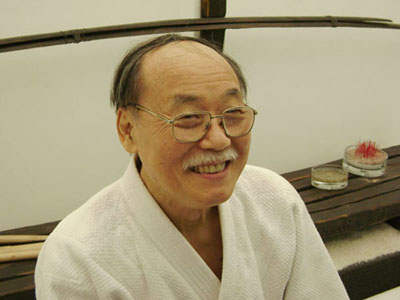

Por diversas vezes meus alunos já me ouviram dizer que uma das pessoas mais
bondosas que tive a oportunidade de conhecer em toda minha vida foi meu falecido
Mestre Kawai Sensei, e ao meditar sobre isso me ocorreu algo que gostaria de
compartilhar não apenas com o público *aikidoísta*, mas com todos que têm ou
que pelo menos alegam buscar a prática do amor.

Kawai Sensei formou alguns milhares de *aikidoístas* em quase meio século que
dedicou sua vida ao ensino e divulgação do *Aikido*, foi sempre exigente, mas
algo que ninguém pode negar é o amor que ele tinha por todos e pelo que fazia.
Muitas vezes ouvimos discursos sobre amor ao próximo que na imensa maioria
das vezes não se manifestam na prática (i.e. só *da boca para fora*), mas o *Sensei*
personificou o sentido mais verdadeiro do **AI** em sua vida, que é a harmonia
que se alcança ao praticar o **verdadeiro Aikido**, a prática do amor.

> No Aikido aprendemos que a **verdadeira vitória**  
> é *masakatsu wagatsu*, a **vitória sobre si mesmo**.

No *Aikido* aprendemos que a **verdadeira vitória** é *masakatsu wagatsu*,
a **vitória sobre si mesmo**. É muito fácil machucar o outro, arrebentar-lhe o
braço ou ombro, mas isso é ser **forte**? Quantas vezes vi Kawai Sensei ser
violentamente agredido e em vez de machucar seu agressor ele simplesmente
o imobilizava e sorria. Já vi tantos criticarem o *Aikido* sem nem mesmo
conhecê-lo, mas isso não seria **julgar**? Me parece que sim!

> Quantas vezes vi Kawai Sensei ser violentamente agredido  
> e em vez de machucar seu agressor ele simplesmente  
> o imobilizava e sorria.

As amizades iniciadas no *Aikido* são verdadeiras e via de regra mantém-se
durante anos, e o principal, não se limitam ao tatame e/ou aos
horários de aula, caso contrário estaríamos praticando uma mentira.
Quando dizemos que somos uma família no *Aikido*, é a mais pura verdade,
aprendi isso com o Sensei, ele por sua vez aprendeu com seu mestre,
e eu ensino aos meus alunos.

Na minha opinião, Reishin Kawai Shihan foi um dos maiores líderes que conheci,
se não o maior, pois ensinou a todos sobre: **amizade**, **companheirismo**,
**fidelidade** e **auxílio** ao próximo, mas principalmente sobre o verdadeiro
amor ao próximo.

Minha profunda gratidão à **grandiosa memória** de Kawai Sensei por haver trazido
ao Brasil essa importante ferramenta de prática de amor presenteada por Deus
à humanidade, o *Aikido*.  
